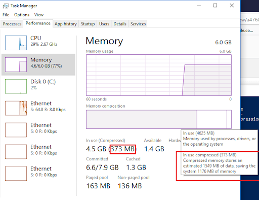
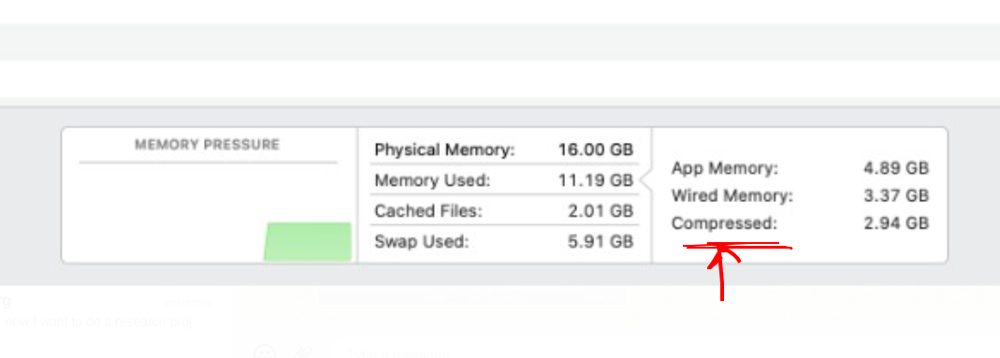

## Better Memory compression in RAM
Project title: Optimized SuperPages
project members: Bhavana, Somesh Mahule, Kartik Modi
## Abstract of the problem, importance and relevance
As of now, linux pages are stored in plain form in the memory. 
We are trying to offer a drop-in page compression in linux, which would compress pages on the fly. 
There are 2 sub-problems
1. Which pages to compress and which to not? Because compression is a overhead. 
2. We should be able to do in-memory compression and not block-based compression.

A large question is to figure out why compression is yet to develop in linux.

## Approach to analyze the problem. relevant papers, existing applications or systems, open-source projects, to motivate the importance of the problem.
### Approach
We will create wrapper data structure on a page. That data structure will hold the compressed page. 
The page will be uncompressed on the fly when it will be accessed. 
Secondly, we'll compress starting least recently used (inactive pages). Further, we'll propose a strategy to determine if a particular page could offer higher compression, so based compressibility we can make it decision.  
### Related Work
1. zram, zcache, zswap - Each has it's tradeoff 
   1. Refer - https://www.kernel.org/doc/html/latest/admin-guide/blockdev/zram.html
   2. https://lwn.net/Articles/545244/
   3. https://github.com/apple/darwin-xnu/blob/main/osfmk/vm/vm_compressor.c
   4. https://www.lifewire.com/understanding-compressed-memory-os-x-2260327
   5. https://wiki.freebsd.org/SummerOfCode2019Projects/VirtualMemoryCompression
2. Other popular OS like MacOS has compression enabled by default from several years.
   Find how Windows & MacOS does compression?  
   Check in BSD & Darwin?
3. Papers - 
   1. https://www.pdl.cmu.edu/PDL-FTP/associated/LCP.pdf
   2. https://iscaconf.org/isca2005/papers/02B-01.PDF
   3. https://www.usenix.org/legacy/event/usenix01/cfp/wilson/wilson.pdf
   4. https://www.cs.utah.edu/~rajeev/pubs/hpca14s.pdf

### Tools
#### Metric Tooling -
* perf
* time
* strace
* /proc/meminfo
* free
#### Benchmark Tooling -
* httpd
* postgres
* FFTW
* rocksDB

## deliverables at the end of the semester; this includes a possible solution to the problem, code demos, and a brief description of what evaluations you will use to evaluate your system
* A approach will be proposed to choose pages eligible for compression.
* A analysis report of above stated application benchmarks with and without compression.
* A code implementation git patch for the linux kernel with compression feature.
* A project which shows how benchmarking was done, tools used, noted metrics, and analysis report.
* A metric which shows how much / how many pages are compressed out of total.
Windows 10 
`

* MacOS
